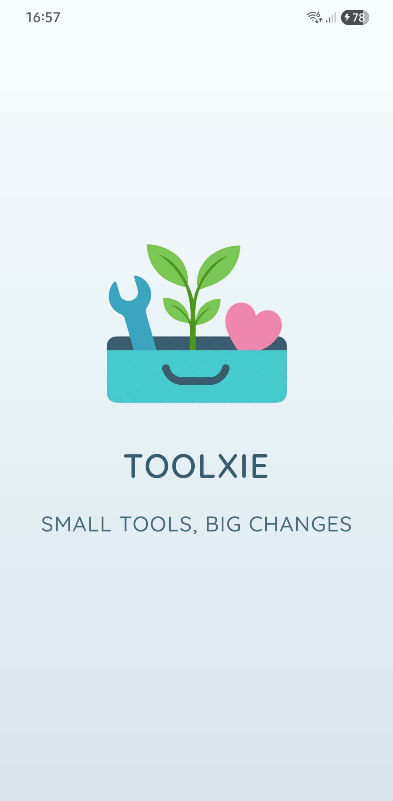
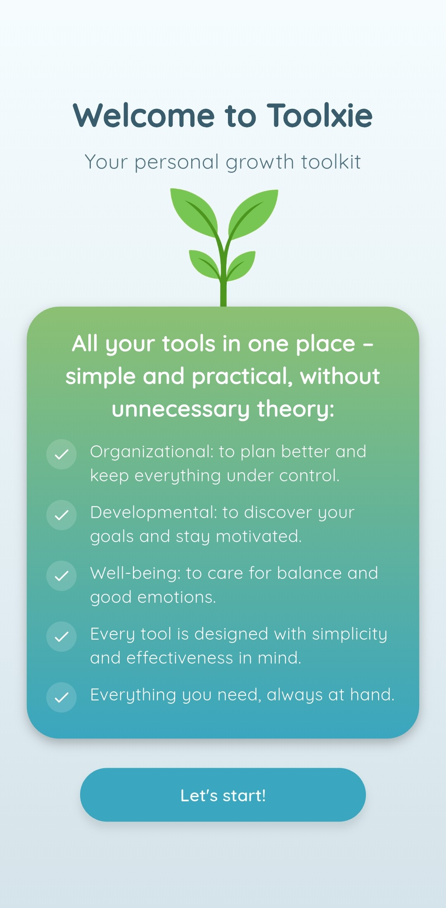
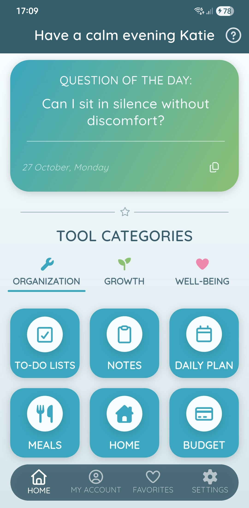
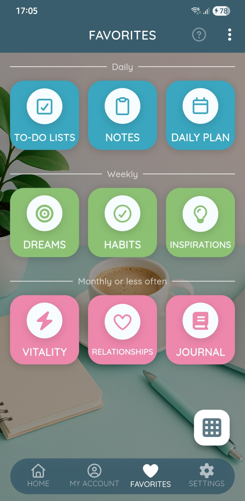
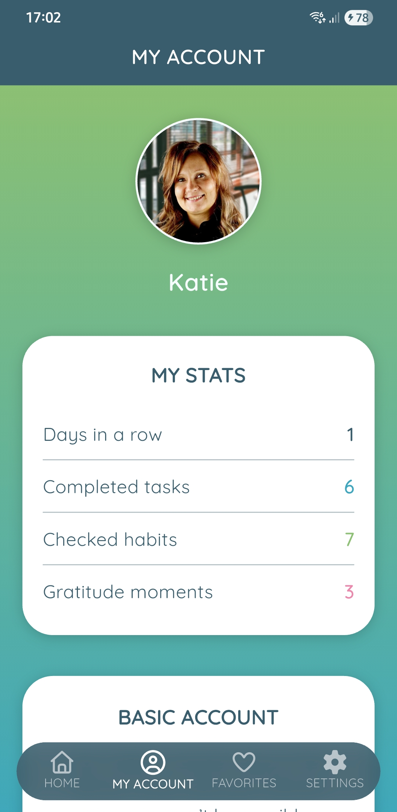
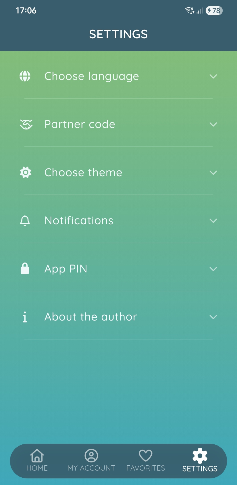
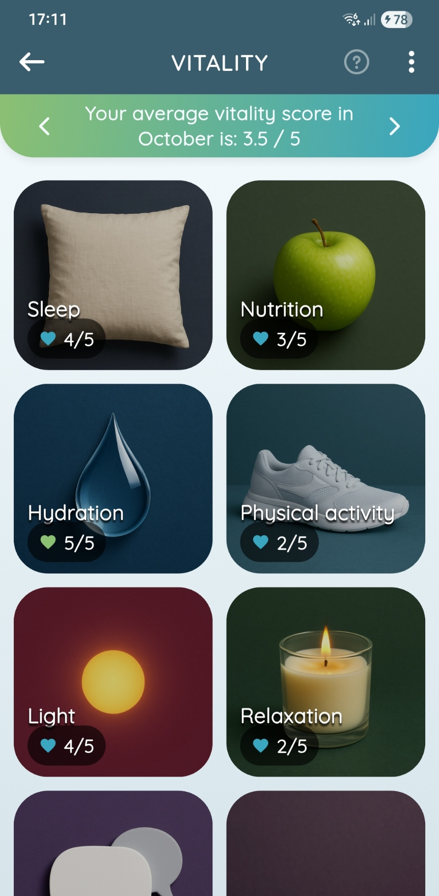
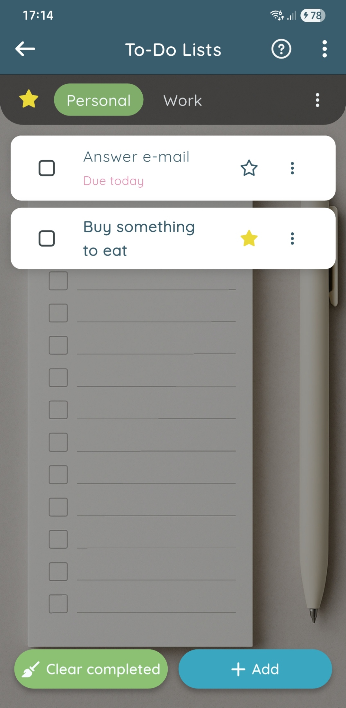
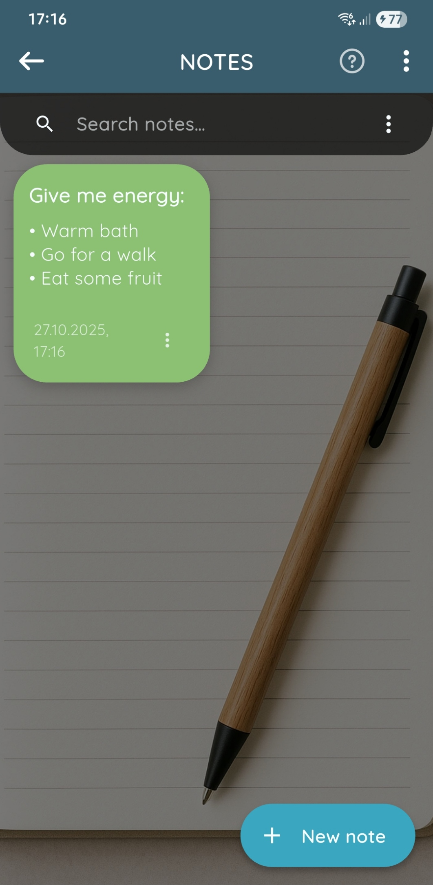

# -Toolxie-

Toolxie is a Flutter-based mobile app for personal growth, productivity, and well-being.  
It helps you organize your life, track habits, reflect, and grow — all in one simple, pastel toolkit.  

With built-in statistics, smart reminders, and beautiful design, Toolxie combines minimalism with daily motivation.  
Available in Polish, English, and Dutch, it’s your calm, practical space for progress.  
Developed with Firebase and SQLite integration for both Android and iOS.

## ✨ Features

- **All-in-one toolkit** – organization, growth, and well-being modules.  
- **Daily statistics** – track tasks, habits, and gratitude moments.  
- **Favorites section** – quick access to your most-used tools.  
- **Smart notifications** – fully personalized reminders created by the user. 
- **App PIN** – secure access to your personal data and notes.  
- **Multilingual support** – Polish, English, and Dutch.  
- **Elegant UI/UX** – pastel colors, soft gradients, and clean typography.  
- **Cross-platform** – developed in Flutter for Android and iOS.  

## 📱 Screenshots

| Splash | Welcome | Home |
|--------|----------|------|
|  |  |  |

| Favorites | Account | Settings |
|------------|----------|-----------|
|  |  |  |

| Tools | Notes | Vitality |
|--------|--------|-----------|
|  |  |  |